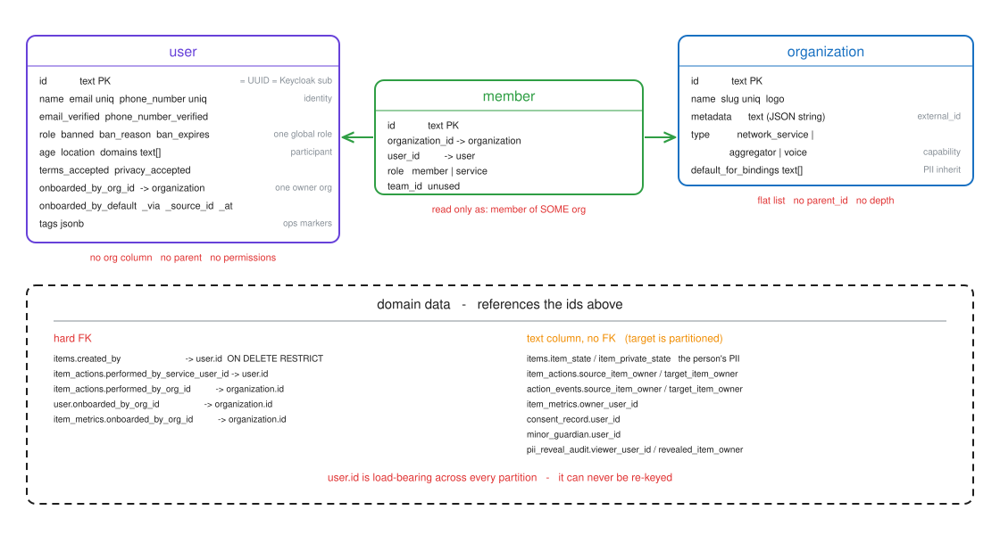
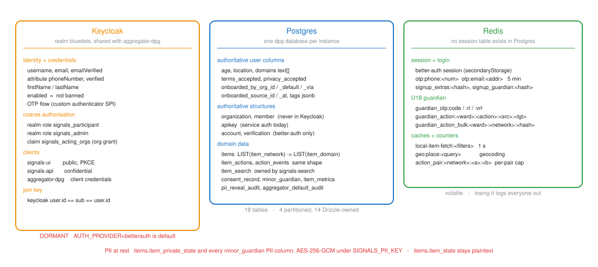
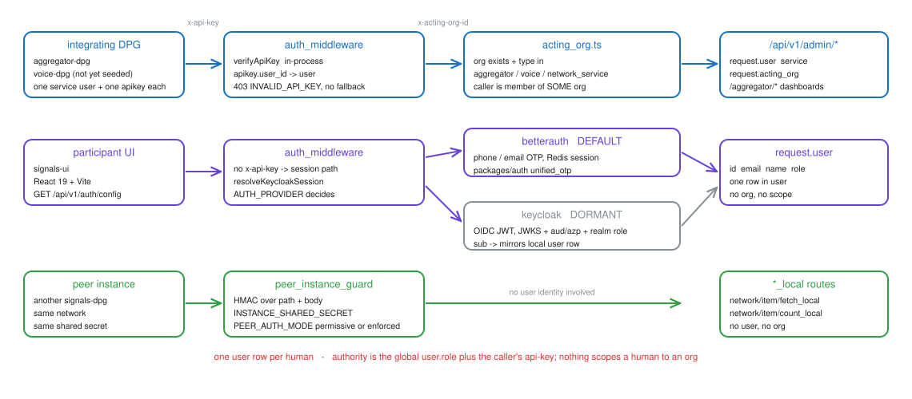

# Signals user model — current state

**Date:** 2026-09-07
**Status:** Baseline capture, for review before the restructure design
**Scope:** `signals-dpg`
**Diagrams:** editable sources in `assets/user-model/*.excalidraw`, rendered to `.svg`

## Summary

Signals has one flat `user` table, one flat `organization` table, and a `member`
join between them. A person is an item owner, not an org member; an org is a
capability tag, not a tier. Nothing in the schema expresses a hierarchy, a
scope, or a permission.

## Highlights

| Fact | Detail |
|---|---|
| One user table | `user` holds identity, participant attributes, and one global `role`. No org column |
| Orgs are flat | `organization` has `type` but no `parent_id` and no `depth`. Three types exist |
| `member` is barely used | It answers "is a member of some org", never "of which org" |
| No permissions anywhere | No permission table, no role-permission map. `request.permissions` is never populated |
| `user.id` is frozen | FK'd and text-referenced across every partition, and equal to the Keycloak `sub` |
| Keycloak ships dormant | `AUTH_PROVIDER=betterauth` is the default; every Keycloak path is inert |

---

## 1. Vocabulary

| Term | Meaning | Example |
|---|---|---|
| network | The shared contract, defined by a `network.json` schema | `blue_dot` |
| domain | A role inside a network. An instance serves one or more via `SERVED_DOMAINS` | `seeker`, `provider` |
| instance | One deployment of the API serving its configured domains | - |
| item | A versioned, schema-typed record owned by a user | `profile_1.0` |
| action | An interaction between two items; `event` is the structured result | `connect`, `apply` |
| org | A row in `organization`: an aggregator, a voice host, or an integrating DPG | `network_service` |

A participant is a `user` row plus one or more profile `items`. There is no
participant table.

---

## 2. Identity data model

Three tables carry identity, all from better-auth's schema. They are read and
written as plain Drizzle tables — the `admin` and `organization` better-auth
plugin APIs are configured but never called.

### `user`

| Group | Columns | Notes |
|---|---|---|
| Key | `id text PK` | Bare UUID |
| Identity | `name`, `email` unique, `phone_number` unique, `email_verified`, `phone_number_verified` | Either identifier can log in |
| Authority | `role`, `banned`, `ban_reason`, `ban_expires` | `role` is `admin` or null, and is global |
| Participant | `age`, `location`, `domains text[]` | `age` is a snapshot, not a birthdate; drives U18 |
| Consent | `terms_accepted`, `privacy_accepted` | Superseded by `consent_record` since #309 |
| Attribution | `onboarded_by_org_id` → `organization`, `onboarded_by_default`, `onboarded_via`, `onboarded_source_id`, `onboarded_at` | One owner org per account |
| Ops | `tags jsonb` | GIN-indexed. Current key: `is_test` |

`domains` may hold several entries — `POST /api/v1/user/domains` unions into
it — and `resolveDomainLockError` blocks item creation outside the stored set.
Signup writes one entry, and admin api-key callers bypass the lock.

### `organization`

| Column | Notes |
|---|---|
| `id text PK`, `name`, `slug` unique, `logo` | `slug` is the upsert key and the Keycloak client id |
| `metadata text` | A JSON *string*, not jsonb. Carries `external_id` and `domains` |
| `type` | `network_service` \| `aggregator` \| `voice`. The whole capability model |
| `default_for_bindings text[]` | Bindings (`blue_dot/seeker`) this org is the default aggregator for |

| Type | Who | Created by |
|---|---|---|
| `network_service` | The integrating DPGs themselves | `scripts/seed_service_users.ts` |
| `aggregator` | Every aggregator registered in aggregator-dpg | `POST /api/v1/admin/aggregator/upsert` |
| `voice` | Voice-hosted instances | Accepted by the middleware; nothing seeds it |

`default_for_bindings` is constrained to `aggregator` orgs, limited to one org
per instance by a unique index on a constant, and audited to
`aggregator_default_audit` by a trigger. There is no API for it — a network
admin nominates a default by a hand-written `UPDATE`.

### `member`

`(id, organization_id, user_id, role, team_id)`; `role` is `member` or
`service`. Written on OTP verify when the client passes `joinOrg`, and by
Keycloak provisioning when the token names an org. Read in one place,
`acting_org.ts`, which only checks that the caller is a member of *some* org.

### Table inventory

| Layer | Tables |
|---|---|
| Identity (Drizzle) | `user`, `organization`, `member`, `account`, `verification`, `apikey` |
| Unused (Drizzle) | `invitation`, `team`, `team_member` — no code imports them |
| Domain (Drizzle) | `item_metrics`, `consent_record`, `minor_guardian`, `pii_reveal_audit`, `aggregator_default_audit` |
| Domain (raw SQL) | `items`, `item_actions`, `action_events` — partitioned; `item_search` — owned by signals-search |

`items` partitions by `item_network` then `item_domain`; `item_actions` and
`action_events` by network then `action_type`. Use the helpers in
`@dpg/database`, never raw DDL.

---

## 3. Where identity lives

| Store | Owns | Today |
|---|---|---|
| Postgres | All of the above, plus every domain row | Authoritative for identity |
| Keycloak | Username, email, phone attribute, name, `enabled`, credentials, realm roles | Dormant |
| Redis | Sessions, OTP codes, guardian OTP scopes, geocode and item-fetch caches | Live |

There is no `session` table. better-auth stores sessions in Redis via
`secondaryStorage`, so losing Redis logs everyone out.

### Keycloak ownership split

`AUTH_PROVIDER` takes two values: `betterauth` (default) and `keycloak`. `dual`
was removed, so an instance still setting it fails at startup, and every user
must be migrated into the realm before a flip — nothing provisions a missing
identity on the fly. Under `keycloak` the `/api/auth/*` mount is not registered
and nothing in `packages/auth` runs.

| Column | Authoritative under `keycloak` |
|---|---|
| `id` | Shared: `keycloak user.id == sub == user.id`, preserved on migration |
| `email`, `phone_number`, `name`, verified flags | Keycloak; mirrored locally because reads join on them |
| `role`, `banned` | Keycloak realm role / `enabled` |
| `age`, `location`, `domains`, consent flags, `onboarded_*`, `tags` | Signals-local, never sent to Keycloak |
| `organization`, `member`, `apikey` | Signals-local. Not modelled as Keycloak groups |

One realm (`bluedots`) per instance, shared with aggregator-dpg. Separation is
by client id and realm role, so `signals-api` checks `azp`/`aud` against two
separate allowlists — `KEYCLOAK_ACCEPTED_CLIENT_IDS` for humans,
`KEYCLOAK_SERVICE_CLIENT_IDS` for DPGs — plus a required realm role.

### PII at rest

| Location | Protection |
|---|---|
| `items.item_state` | Plaintext. Only declared, non-private fields are searchable |
| `items.item_private_state` | AES-256-GCM under `SIGNALS_PII_KEY`, versioned `v1:` blob |
| `minor_guardian` name and contacts | Same key and scheme; `guardian_ref` is an HMAC for counting wards without decrypting |
| `item_locations` | Jittered for PII locations |

Retire is terminal: it scrubs `item_state`, clears the private blob, wipes
`item_locations`, cancels open connections, and de-indexes the item.

---

## 4. How a request gets an identity

| Path | Credential | Resolves to | Guard |
|---|---|---|---|
| Service | `x-api-key` (+ `x-acting-org-id`) | The apikey's owning `user` row | `auth_middleware`, then `acting_org.ts` |
| Human | Session cookie or bearer | One `user` row | `auth_middleware` → `resolveKeycloakSession` |
| Peer | HMAC instance token | Nothing — no user, no org | `peer_instance_guard` |

`x-api-key` is checked first and never falls back: an invalid key is
`403 INVALID_API_KEY`. `AUTH_MIDDLEWARE_ENABLED=false` disables the whole path,
and is honoured only when `INSTANCE_ENV=development`.

`/api/v1/admin/*` and the aggregator read paths also require
`x-acting-org-id`. `acting_org.ts` checks the header is present, the org
exists, its `type` is allowed, and the caller is a member of some org.

| `ACTING_ORG_SOURCE` | Behaviour |
|---|---|
| `header` | The caller authorises itself. Today's default |
| `claim_preferred` | Check the token's `signals_acting_orgs` grant when present, else the header |
| `claim_required` | Refuse a token with no grant |

### What authority actually exists

| Question | Answered by |
|---|---|
| Is this a platform admin? | `user.role == 'admin'`, and only in `create_item` and `update_item` |
| May this caller act for org X? | `organization.type`, plus the token grant when enabled |
| Which participants may this org decrypt? | `user.onboarded_by_org_id` of the item's creator |
| May this user create a profile in domain D? | `user.domains`, and the served-domain binding |
| May this user act on item I? | Item ownership, the U18 gate, the per-pair action cap |

None of those is a permission. There is no permission table and no
role-permission map; `request.permissions` is declared but never assigned, so
the `apikey.permissions` column is never consulted.

---

## 5. How a user comes to exist, and who owns them

| Path | Entry point | Provider | Gate |
|---|---|---|---|
| Admin onboarding | `POST /api/v1/admin/participant` | Both | Api-key + acting org. Not gated by `SELF_SIGNUP_MODE` |
| Public OTP verify | `/api/auth/*` → `unified_otp.verifyOtp` | betterauth | `assertSelfSignupAllowed`, at request *and* verify |
| Public self-signup | `POST /api/v1/auth/signup` → `selfSignup` | keycloak | Same policy, re-implemented in `provisioning.ts` |
| First-login mirror | `provisionUserFromClaims` | keycloak | A `sub` with no local row is refused when gated |
| Operator admin | `scripts/create_admin_user.ts` | Both | Explicit, dry-run by default |
| Service account | `scripts/seed_service_users.ts` | - | Ids are `usr_`-prefixed; they never log in |

`SELF_SIGNUP_MODE` defaults to `gated`, so public account creation is off until
an operator opens it. `LOGIN_CHANNELS` (default `phone,email`) decides which
identifier a person may use. Under `keycloak`, `selfSignup` writes no local
`user` row — the row appears on first successful login. Under `betterauth`,
admin onboarding goes through `signUpEmail`, which demands an email and so
synthesises `<uuid>@no-email.local` for phone-only participants.

`user.onboarded_by_org_id` is the tenancy key: it decides participant reads,
dashboard scoping, and PII decryption.

| Caller | Owner assigned |
|---|---|
| `aggregator` | The acting org itself |
| `voice`, `network_service` | The default aggregator for the `<network>/<domain>` binding, or null |
| Self-signup | The default aggregator, tagged on domain set or first profile create |

Ownership is per account, not per profile, and effectively write-once.
`organization` has no status column, so "an approved aggregator" is a runbook
guarantee, not an enforced one.

---

## 6. What blocks a multi-level restructure

| # | Blocked | Cause |
|---|---|---|
| S1 | Any hierarchy at all | `organization` has no `parent_id`, `depth` or `path`. The only tree in the ecosystem is aggregator-dpg's |
| S2 | Scoping a human to an org | `member` is read only as "member of some org". `request.user` carries no org and no scope |
| S3 | More than one authority level | `user.role` is one global column with two values, checked in two routes |
| S4 | Roles as data | No permission table, no role-permission map. `request.permissions` is dead code |
| S5 | A person in two tenancies | `user.onboarded_by_org_id` is one column, per account, and PII decrypt scopes on it with no domain condition |
| S6 | Two defaults per instance | `organization_single_default_idx` blocks it, precisely because S5 makes it unsafe |
| S7 | Domain-scoped membership | `user.domains` and the domain lock sit on the account, so nobody can be a seeker under one org and a provider under another |
| S8 | Structured org attributes | `organization.metadata` is a JSON *string*: it must be parsed, and cannot be indexed or constrained |
| S9 | Re-keying identity | `user.id` is FK'd `ON DELETE RESTRICT` from `items`, text-referenced across every partition, and equals the Keycloak `sub` |
| S10 | Verifying the acting org | `acting_org.ts` never checks membership of the *asserted* org, and the default `ACTING_ORG_SOURCE=header` lets the caller authorise itself |

S9 is the hard constraint. S10 is a live gap to close rather than inherit.

---

## 7. What a restructure must not move

| Invariant | Why |
|---|---|
| `user.id` stays a bare UUID and is never re-issued | It is the Keycloak `sub` and the FK target for every item |
| `organization.id` stays stable | FK'd from `user`, `item_actions`, `item_metrics` |
| `items.created_by` keeps pointing at a `user` row | `ON DELETE RESTRICT`, on a partitioned table |
| The `request.user` / `request.acting_org` shape | Every route reads these, not headers |
| `organization` and `member` stay in Postgres | Read per request for gating and ownership; not Keycloak groups |
| Generated Drizzle migrations are never hand-edited | Change the schema file, run `pnpm db:generate:api` |
| New env vars land in two places | `packages/config/src/secrets.ts` and `turbo.json` `globalPassThroughEnv` |

`apps/api/db/postgres/schema.sql` is applied *after* the Drizzle migrations,
because `items.created_by` FKs the Drizzle-owned `user` table. A restructure
that renames or splits `user` has to keep that ordering, and every new column
needs both a `CREATE TABLE` entry and an `ADD COLUMN IF NOT EXISTS` guard.

---

## 8. Related work and open questions

| Spec | Branch | Covers |
|---|---|---|
| `2026-08-30-account-profile-identity-model-design.md` | `spec/account-profile-identity-model` | Which attributes belong to the account vs the profile; per-profile origin (#661) |
| `2026-07-15-account-schema-separation-design.md` | `spec/account-schema-separation` | Separating the account schema from `network.json` |
| `2026-07-31-replace-better-auth-with-keycloak.md` | `feature` | The identity-provider switch this model assumes |

| # | Question | Why it matters |
|---|---|---|
| Q1 | Does the tree live in signals, or stay in aggregator-dpg with signals holding only leaves? | Two trees for one hierarchy is the failure mode to avoid |
| Q2 | Is tenancy per account or per profile? | Decides whether S5 and S6 are fixed or inherited |
| Q3 | Does a participant become a `member` of their owning org? | Today they never are, so making them one redefines `member` |
| Q4 | Must the Keycloak flip land first? | `dual` is gone, so an instance cannot straddle providers during a data migration |
| Q5 | Do domains become roles on a membership, or stay on the account? | `user.domains` is the current single-role guarantee |
| Q6 | Does `organization` gain a status column? | "Approved aggregator" is unenforced today, and it gates PII decrypt |
